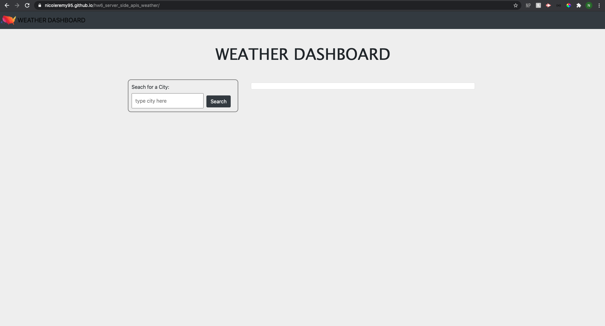
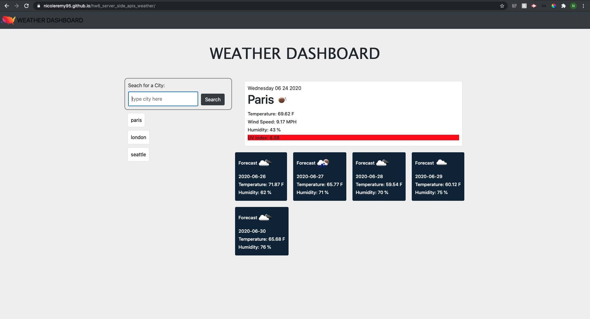
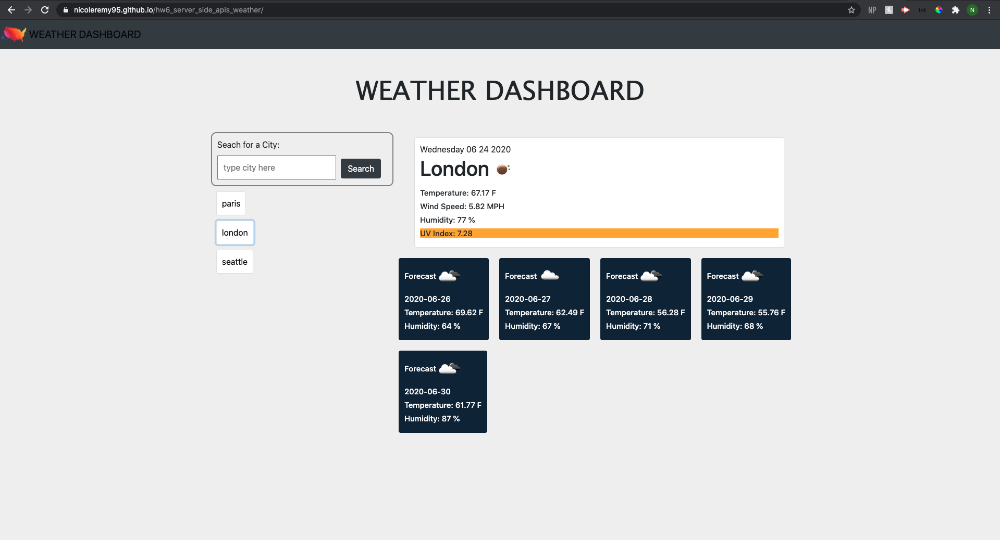

# hw6_server_side_apis_weather
Server side APIs weather application 

In this project, I have created a weather dashboard for cities across the world. Using third-party Open Weather Map API, users can enter a city and retreive current and future weather information on that particular city. Then, if the user clicks the newly created button of the city, the information is then displayed again. 

The current weather information includes the date, an icon representing the current weather, the temperature, the humidity, the wind speed, and the UV index. When the user views the UV Index, the color of the index indicates whether teh conditions are favorable, moderate, or severe. The user can also view the forecast for the next 5 days. This displays the icon representing the weather conditions, the temperature, and the humidity. When a user refreshes the page, the city buttons stay on the page. 

I used html, css, javascript, jquery, moment.js, and bootstrap to make this website. 

## Images of Completed Website 

### Step 1

### Step 2

### Step 3

### Step 4

### Step 5

## Link to Site

Deployed website [Weather Dashboard] (https://nicoleremy95.github.io/hw6_server_side_apis_weather/)

## Contributing
Pull requests are welcome. For major changes, please open an issue first to discuss what you would like to change.

Please make sure to update tests as appropriate.

## License
[NER](https://choosealicense.com/licenses/mit/)